# 📊 **Informe de Prácticas: Jenkins Lab** 🚀

---

## 🧩 **1. Ejecutar Docker Compose** 🐳

### 📋 **Pasos para ejecutar Docker Compose:**

1. **Navegar a la ubicación** donde se encuentra el archivo `docker-compose.yml`. 📂
2. **Iniciar los contenedores** definidos en el archivo ejecutando el siguiente comando en la terminal:

    ```bash
    docker-compose up -d
    ```

3. **Extraer contraseñas** 🔐

   - Primero, visualiza los logs del contenedor para obtener el ID del contenedor:

     ```bash
     docker logs id_container
     ```

   - Luego, extrae la contraseña de administrador inicial con el siguiente comando:

     ```bash
     docker exec id_container cat /var/jenkins_home/secrets/initialAdminPassword
     ```

---

## ⚙️ **2. Iniciar Jenkins** 🏁

Una vez que los contenedores están en funcionamiento, accede a Jenkins desde tu navegador. 🌐

- **Miramos los logs** para extraer la clave y así ingresar a la interfaz de Jenkins.
  
  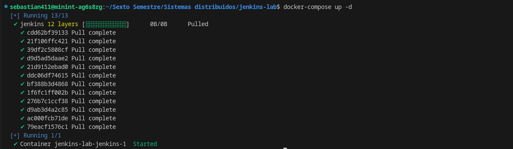
  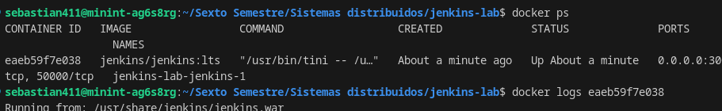

---

## 🔧 **3. Configurar Jenkins** 🛠️

### 🖱️ **Paso a Paso:**

1. **Accede con la contraseña extraída.**
  
   - A continuación, se presentan algunas imágenes de la configuración inicial de Jenkins:
  
     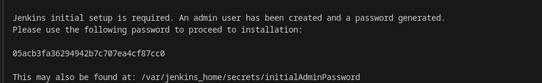  
     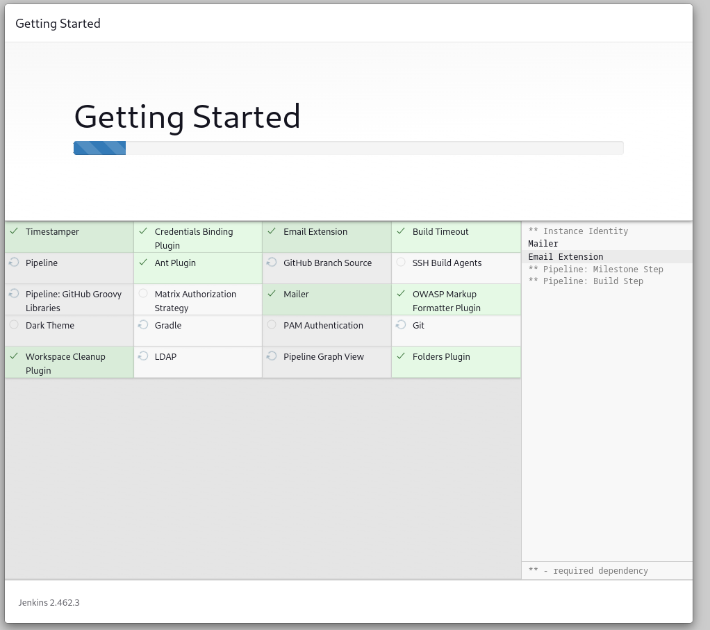
     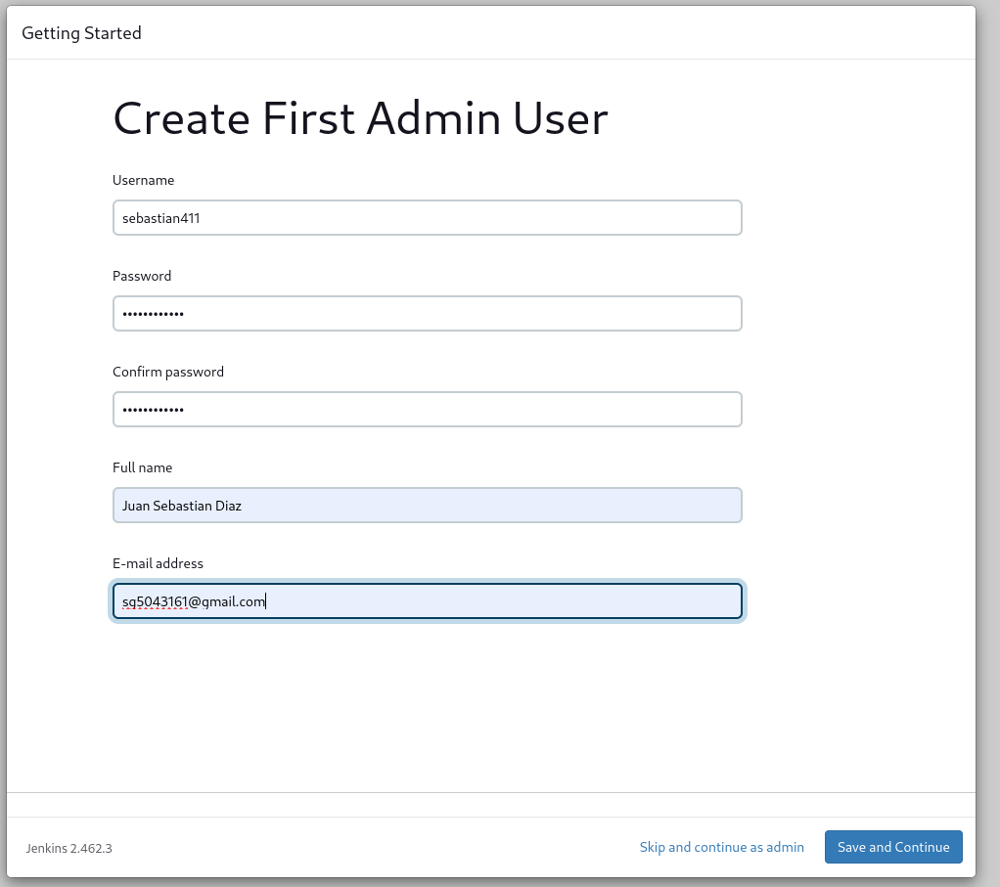

2. **Instalar plugins adicionales**:
  
   - Por ejemplo, instalamos el plugin de **NodeJs** para añadir soporte a aplicaciones Node.  
  
     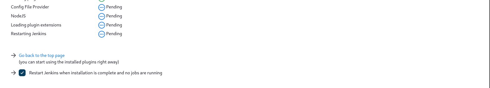

3. **Crear una nueva herramienta de NodeJs** desde la configuración del sistema.

   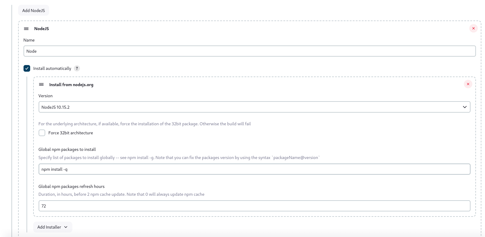

4. **Generar un workspace** para tus proyectos:

   - Esto te permitirá organizar mejor tus pipelines.  
   
     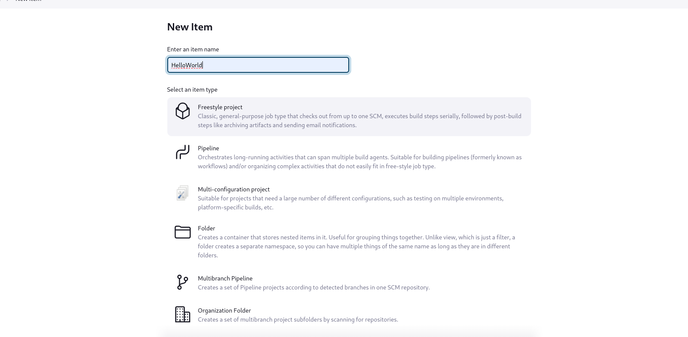

---

## 🔗 **4. Configurar el repositorio** 📂

Con Jenkins listo, configúralo para conectarse a tu repositorio de código (GitHub, GitLab, Bitbucket, etc.). 

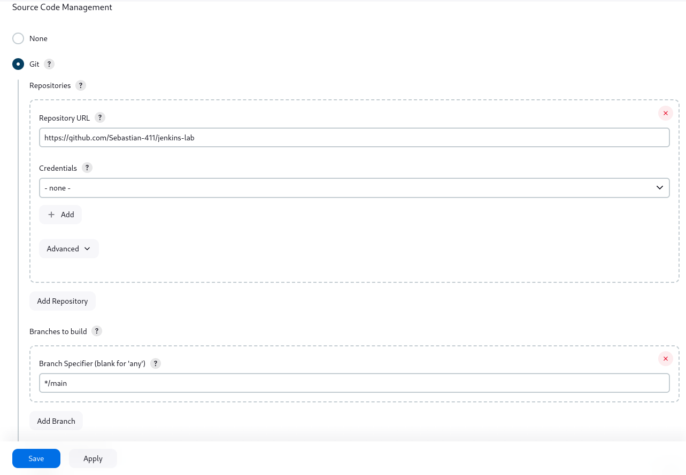

---

## 🧩 **5. Configurar NodeJs** 🌐

En este paso, aseguramos que Jenkins reconozca la herramienta NodeJs instalada previamente y que pueda usarla en los jobs.

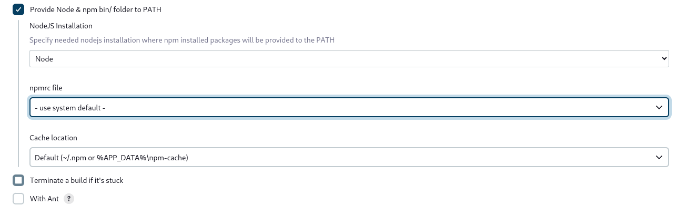

---

## 🚦 **6. Configurar el Pipeline** 🛠️

1. Accede a la sección de **Pipeline**.
2. Define el script del pipeline que gestionará las tareas como `build`, `test`, o `deploy`.

   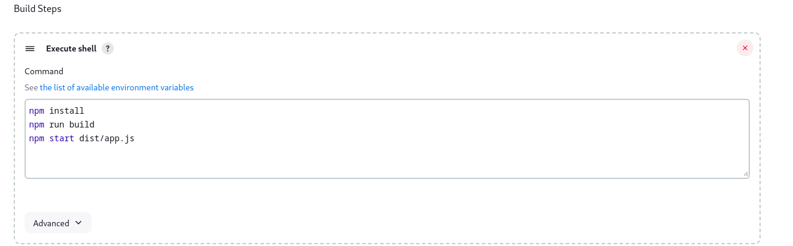

---

## 🔍 **7. Revisión Final** ✔️

Revisamos que todo esté correctamente configurado y ejecutamos el pipeline.

   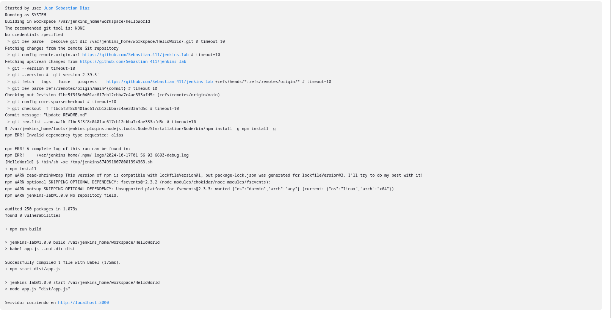

⚠️ **Nota**: En el pipeline se recomienda eliminar los pasos de ejecucion del proyecto.
--- 

# ✅ **Conclusión** 🎯

Hemos logrado configurar un entorno completo con Jenkins utilizando Docker, instalando plugins relevantes y configurando un pipeline básico..